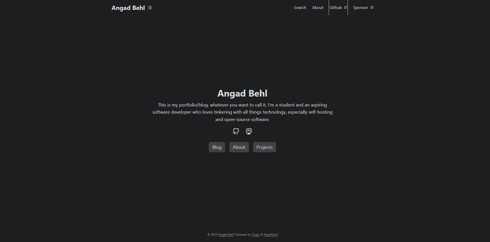

# My portfolio/blog!  
  

## Building  
This website is built using [Hugo](https://gohugo.io/). Ensure that it's installed before building.  
1. Clone the repository
2. Fetch the submodules: `git submodule update --init --recursive`
3. Run `hugo serve` to start the development server or `hugo` to build the website.